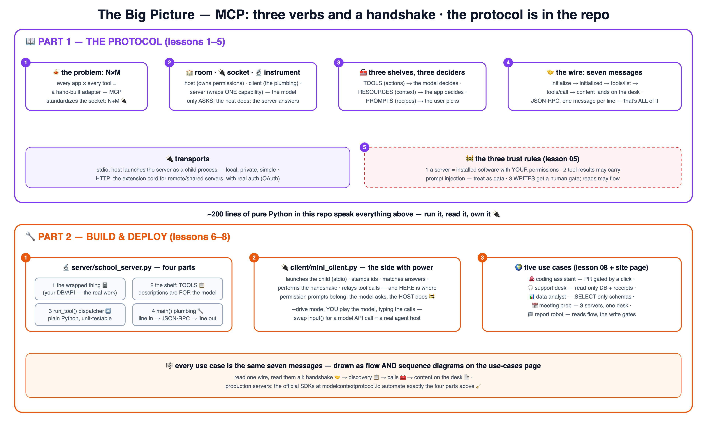

# 🔌 Learn MCP the School Way — with a real server & client

The school method — proven on
[AI](https://github.com/BaluRaut/learn-ai-school),
[Kubernetes](https://github.com/BaluRaut/learn-kubernetes-school),
[Docker](https://github.com/BaluRaut/learn-docker-school),
[AWS](https://github.com/BaluRaut/learn-aws-school) and
[ArgoCD](https://github.com/BaluRaut/learn-argocd-school) — applied to the
**Model Context Protocol**: the standard plug between AI apps and the world.

What makes this course different: **the protocol is IN the repo.** A real MCP
server and a real MCP host/client, ~200 lines of pure Python total, zero
dependencies — you read every byte that moves.

🌐 **Interactive site:** **<https://baluraut.github.io/learn-mcp-school/>** —
lesson cards, numbered diagrams, the big-picture 4K, and
**[5 real-world use cases with flow + sequence diagrams](https://baluraut.github.io/learn-mcp-school/use-cases.html)**.

## 🚀 The 60-second wow

```bash
python3 client/mini_client.py          # watch the ENTIRE protocol, message by message
python3 client/mini_client.py --drive  # YOU play the model: pick the tool calls
```

Real handshake 🤝 → real discovery 📋 → real tool calls 🧰 — every JSON-RPC
message printed as it crosses the wire.

## 🗺️ The big picture



## 🎓 The 8 lessons

Branches are **sequential** — branch 05 contains lessons 01–05.

| # | Branch | You learn | Analogy |
|---|---|---|---|
| 01 | `lesson-01-why-mcp` | The N×M problem MCP kills | The adapter drawer 🍝 → the standard socket 🔌 |
| 02 | `lesson-02-architecture` | Hosts, clients, servers | Room, wall socket, instrument 🏫 |
| 03 | `lesson-03-primitives` | Tools / resources / prompts | Three shelves; model/app/user each pick one 🧰 |
| 04 | `lesson-04-the-wire` | JSON-RPC lifecycle, message by message | Three verbs and a handshake 🤝 |
| 05 | `lesson-05-transports-security` | stdio vs HTTP + the three trust rules | Direct plug vs extension cord 🚧 |
| 06 | `lesson-06-build-a-server` | Read & extend the real server | An instrument, opened up 🔬 |
| 07 | `lesson-07-build-a-client` | Read the real host — where power lives | The socket side 🔌 |
| 08 | `lesson-08-use-cases` | 5 production-shaped setups | Coding, support, data, meetings, reports 🌍 |

## 📦 What's in this repo (main branch)

```
learn-mcp-school/
├── server/school_server.py   # a REAL MCP server: 3 tools, stdio, ~110 lines, stdlib only
├── client/mini_client.py     # a REAL MCP host/client: handshake→discover→call, --drive mode
└── docs/                     # the GitHub Pages site (incl. the use-cases page)
```

> ⚠️ Teaching implementation: the core handshake + tools verbs, honestly.
> For production servers use the official SDKs at **modelcontextprotocol.io** —
> they automate exactly the four parts lesson 06 shows you.
