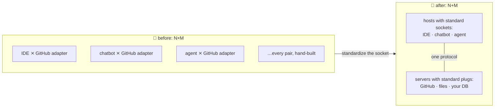

# 🍝 Lesson 01 — Why MCP: the adapter drawer problem

**📍 You are here:** Lesson **01** of 8 · Next: `lesson-02-architecture`

---

## 📦 What's in this branch

The problem MCP exists to kill — and the one idea (N×M → N+M) that
explains every design choice in the protocol.

> 🎒 **Before you start:** this is the deep-dive companion to the [AI course's bonus lesson 13](https://github.com/BaluRaut/learn-ai-school/blob/lesson-13-mcp/lessons/13-mcp/README.md), and a good stop before or after the [Agents school](https://baluraut.github.io/learn-agents-school/). You need **Python 3 only**. **What this is not:** a production-SDK tutorial — this school teaches the *protocol* (revision **2026-07-28**, the current one) by showing every byte; for real servers use the official SDKs.

## 🧒 Explain like I'm 5

The school science lab 🔬: every instrument (microscope, scale,
thermometer) ships with its **own weird cable**, and every classroom has
**different sockets**. Microscope in Room 3? Hand-build a
Room-3-microscope adapter. New scale? Five rooms = five more adapters.

**N rooms × M instruments = N×M adapters.** The janitor's drawer is
spaghetti. 🍝 And it's not hypothetical — that was AI tooling before
MCP: your GitHub integration for the IDE, ANOTHER one for the chatbot, a
THIRD for your agent. Same capability, rebuilt per app, forever.

The fix schools (and industries) always land on: **standardize the
socket** 🔌. Every instrument ships the standard plug; every room has
the standard wall socket. Any instrument, any room: **N+M**.

MCP is that socket for AI: apps (**hosts**) get sockets, capabilities
(**servers**) get plugs, and this repo contains a REAL working pair —
[server/school_server.py](../../server/school_server.py) and
[client/mini_client.py](../../client/mini_client.py) — that you'll read
in full by lesson 07. No magic will remain.

## 🗺️ Diagram



## ❓ What

- **MCP** (Model Context Protocol): an open standard (Anthropic, late
  2024; adopted ecosystem-wide) for connecting AI applications to tools
  and data. USB-C for AI, the school-socket way.
- The economics: integrations become **shareable parts**. Write your
  database server once → it works in Claude Desktop, your IDE, and your
  custom agent, unchanged.
- History rhyme you already know from the other schools: containers
  standardized "how software ships" (Docker course), Kubernetes
  standardized "how it runs" — **boring shared interfaces are how
  ecosystems happen**. MCP does it for "how AI reaches things".

## 🤔 Why this course (vs the AI course's bonus lesson)

The [AI course's lesson 13](https://github.com/BaluRaut/learn-ai-school/blob/lesson-13-mcp/lessons/13-mcp/README.md)
gives the aerial view. This school goes to the ground: the actual
architecture (L02), the three primitives (L03), the wire byte-by-byte
(L04), security honestly (L05), then you READ a real server and client
(L06–07) and study five production-shaped use cases with sequence
diagrams (L08).

## 🧪 Try it (60 seconds — the whole protocol, live)

```bash
python3 client/mini_client.py
```

Watch: introductions 🪪 (`server/discover`), a discovery 📋, three tool calls 🧰 — every JSON message printed, each request wearing its `_meta` badge (revision 2026-07-28: no handshake). That conversation is the entire subject of this course. You should see, trimmed:

```text
═══ 1) introductions 🪪 — server/discover (optional since 2026-07-28) ═══
→ {"jsonrpc": "2.0", "id": 1, "method": "server/discover", "params": {"_meta": {"io.modelcontext …
← {"jsonrpc": "2.0", "id": 1, "result": {"resultType": "complete", "supportedVersions": ["2026-0 …
   🔬 school-server v2.0.0 speaks ['2026-07-28'] · stocks: tools
═══ 2) discovery 📋 — 'what do you offer?' ═════════════════
→ {"jsonrpc": "2.0", "id": 2, "method": "tools/list", "params": {"_meta": {"io.modelcontextproto …
← {"jsonrpc": "2.0", "id": 2, "result": {"resultType": "complete", "tools": [{"name": "get_stude …
   🧰 get_student_count: How many students are in a class (3A or 3B)?
   🧰 lookup_grade: Look up one student's grade (read-only).
   🧰 add_homework: Add a homework item (WRITES state — hosts should confirm with the user!).
═══ 3) tool calls 🧰 — what an agent's loop would do ═══════
→ {"jsonrpc": "2.0", "id": 3, "method": "tools/call", "params": {"name": "get_student_count", "a …
← {"jsonrpc": "2.0", "id": 3, "result": {"resultType": "complete", "content": [{"type": "text",  …
   📄 lands on the desk: Class 3A has 3 students: aarav, sita, kabir.
→ {"jsonrpc": "2.0", "id": 4, "method": "tools/call", "params": {"name": "lookup_grade", "argume …
← {"jsonrpc": "2.0", "id": 4, "result": {"resultType": "complete", "content": [{"type": "text",  …
   📄 lands on the desk: Sita (3A) has grade A+.
→ {"jsonrpc": "2.0", "id": 5, "method": "tools/call", "params": {"name": "add_homework", "argume …
← {"jsonrpc": "2.0", "id": 5, "result": {"resultType": "complete", "content": [{"type": "text",  …
   📄 lands on the desk: Added ✏️ — homework list is now: [{"title": "read MCP lesson 05", "due": "Friday"}]
═══ done — that was the ENTIRE protocol: three verbs and a badge 🪪 (no handshake since 2026-07-28) ═══
```
By lesson 07 you'll have written both sides of it in your head.

## ✅ Verify — what you should see

`python3 client/mini_client.py` prints three sections — 🪪 introductions (`server/discover`), 📋 discovery (three tools listed), 🧰 three tool calls — each with a `→` request line and a `←` reply line, and ends with `done — that was the ENTIRE protocol`. Exit code 0, no stack trace. The trimmed expected output is under the command in the Try-it section.

## 🏁 What you just proved

You ran a real MCP server and a real MCP host with nothing installed beyond Python 3 — the socket is not magic, it is ~230 lines you will read.

## ⚠️ Common mistakes

- running the client from another directory — it launches `server/school_server.py` relative to the repo root; run it from the repo root
- installing an SDK first — nothing here needs one; that is the point
- expecting a handshake in the output because older tutorials show one — revision 2026-07-28 removed it (lesson 04)

> 🏭 **Why this matters in production:** MCP's value is the N+M economics: one server per capability, reused by every host. Teams that adopt it well treat servers as shared infrastructure — versioned, reviewed, least-privilege — rather than per-app glue.

## ⏭️ Next

Who exactly talks to whom? Hosts, clients, servers — the three roles.

```bash
git checkout lesson-02-architecture
```
