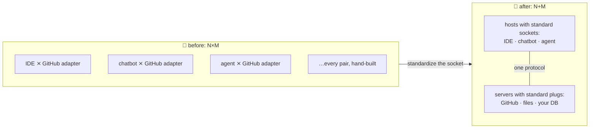

# 🍝 Lesson 01 — Why MCP: the adapter drawer problem

**📍 You are here:** Lesson **01** of 8 · Next: `lesson-02-architecture`

---

## 📦 What's in this branch

The problem MCP exists to kill — and the one idea (N×M → N+M) that
explains every design choice in the protocol.

## 🧒 Explain like I'm 5

The school science lab 🔬: every instrument (microscope, scale,
thermometer) ships with its **own weird cable**, and every classroom has
**different sockets**. Microscope in Room 3? Hand-build a
Room-3-microscope adapter. New scale? Five rooms = five more adapters.

**N rooms × M instruments = N×M adapters.** The janitor's drawer is
spaghetti. 🍝 And it's not hypothetical — that was AI tooling before
MCP: your GitHub integration for the IDE, ANOTHER one for the chatbot, a
THIRD for your agent. Same capability, rebuilt per app, forever.

The fix schools (and industries) always land on: **standardize the
socket** 🔌. Every instrument ships the standard plug; every room has
the standard wall socket. Any instrument, any room: **N+M**.

MCP is that socket for AI: apps (**hosts**) get sockets, capabilities
(**servers**) get plugs, and this repo contains a REAL working pair —
[server/school_server.py](../../server/school_server.py) and
[client/mini_client.py](../../client/mini_client.py) — that you'll read
in full by lesson 07. No magic will remain.

## 🗺️ Diagram



## ❓ What

- **MCP** (Model Context Protocol): an open standard (Anthropic, late
  2024; adopted ecosystem-wide) for connecting AI applications to tools
  and data. USB-C for AI, the school-socket way.
- The economics: integrations become **shareable parts**. Write your
  database server once → it works in Claude Desktop, your IDE, and your
  custom agent, unchanged.
- History rhyme you already know from the other schools: containers
  standardized "how software ships" (Docker course), Kubernetes
  standardized "how it runs" — **boring shared interfaces are how
  ecosystems happen**. MCP does it for "how AI reaches things".

## 🤔 Why this course (vs the AI course's bonus lesson)

The [AI course's lesson 13](https://github.com/BaluRaut/learn-ai-school/blob/lesson-13-mcp/lessons/13-mcp/README.md)
gives the aerial view. This school goes to the ground: the actual
architecture (L02), the three primitives (L03), the wire byte-by-byte
(L04), security honestly (L05), then you READ a real server and client
(L06–07) and study five production-shaped use cases with sequence
diagrams (L08).

## 🧪 Try it (60 seconds — the whole protocol, live)

```bash
python3 client/mini_client.py
```

Watch: a handshake 🤝, a discovery 📋, three tool calls 🧰 — every JSON
message printed. That conversation is the entire subject of this course.
By lesson 07 you'll have written both sides of it in your head.

## ⏭️ Next

Who exactly talks to whom? Hosts, clients, servers — the three roles.

```bash
git checkout lesson-02-architecture
```
