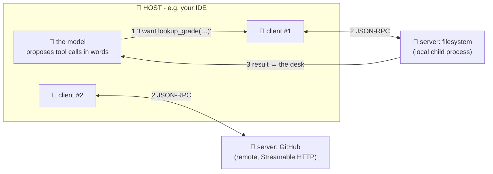

# 🏫 Lesson 02 — The architecture: hosts, clients, servers

**📍 You are here:** Lesson **02** of 8 · Previous: `lesson-01-why-mcp` · Next: `lesson-03-primitives`

---

## 📦 What's in this branch

Lesson 01, **plus** the three roles and exactly who talks to whom —
the map you need before reading any wire traffic.

## 🧒 Explain like I'm 5

Three roles in the socket system:

- **The room** 🏫 (**host**) — the AI application the human actually
  uses: Claude Desktop, an IDE, your custom agent app. The room decides
  which instruments get plugged in, and it's where the model (the
  student 🧠) sits at its desk.
- **The wall socket** 🔌 (**client**) — INSIDE the room, one socket per
  plugged-in instrument. The socket handles the electrical details: the
  handshake, message framing, matching answers to questions. One room
  can have many sockets (files + GitHub + database, all at once).
- **The instrument** 🔬 (**server**) — a small program wrapping ONE
  capability. It doesn't know or care which room it's in — it just
  answers the standard questions. Our
  [school_server.py](../../server/school_server.py) is ~125 lines of exactly this.

The subtle, important bit: **the model never touches the socket.** The
student says "I want to call `lookup_grade`" *in words* (a structured
tool call — AI course L11); the ROOM decides whether to actually do it,
the socket carries the message, the instrument answers, and the result
is placed on the student's desk. Model proposes; host disposes. That gap is where all of lesson 05's safety lives.

**Who decides what** — the table to keep:

| Decision | Who decides | Where it lives |
|---|---|---|
| which instruments are plugged in | the **user** (via the host's settings) | host config / allow-list |
| what goes on the desk (resources, history) | the **host / app** | host |
| which tool to call, with which arguments | the **model** — as a *proposal* | model output |
| whether that call actually runs | the **host** (policy, permission prompt) | host — the power moment (L07) |
| whether a *write* happens | a **human click** (policy 3, L05) | host UI |
| what the tool does and returns | the **server** | server code |


## 🗺️ Diagram



## ❓ What

- **Host** = the application; owns the user relationship, the model
  conversation, and ALL permission decisions. One host, many clients.
- **Client** = one connection to one server; speaks the protocol,
  relays discovery and calls. Boring on purpose — plumbing should be.
- **Server** = the capability wrapper. Local (host launches it as a
  child process — stdio) or remote (Streamable HTTP, with its own identity). It publishes what it offers
  (lesson 03) and answers calls. It never sees your other servers, your
  prompt history, or the model itself — only its own conversation.
- Isolation is a feature: the GitHub server can't read what the
  filesystem server said; each socket is its own circuit.

## 🤔 Why

Every debugging session and every security question routes through this
map: "the model did X" is almost always "the HOST allowed X". And the
reason a server written by a stranger works in your room — without
knowing anything about it — is that the roles only meet at the
standard socket. Narrow interfaces, swappable parts: the whole trick.

## 🧪 Try it

```bash
python3 client/mini_client.py
```

Now name the roles in what you see: `mini_client.py` is playing **host
AND client** (it launches the child and owns the socket);
`school_server.py` is the **instrument**; and in part 3, the scripted
calls stand in for the **model proposing**. Then run with `--drive` —
now YOU are the model, and notice: you can only *propose*; the host mediates and the client does the touching.

## ✅ Verify — what you should see

In the scripted run, `→` lines are the client (socket) speaking and `←` lines the server; nothing the model would *say* ever appears on the wire. In `--drive` you type a request *for* a call and the host turns it into `tools/call`.

## 🏁 What you just proved

The three roles are separable in code: `MiniHost` (room + socket) and `school_server.py` (instrument) meet only at the wire; the model never touches the socket.

## ⚠️ Common mistakes

- calling the whole app 'the client' — the client is one connection to one server; the host owns the user, the model and the permission decisions
- expecting the server to know about your other servers or the conversation — it sees only its own wire
- assuming the model can call tools directly — it can only propose; the host mediates (lesson 07)

> 🏭 **Why this matters in production:** "who decides what" is your security architecture. Put permission prompts, allow-lists and logs in the host, because that is the only place that sees both the model's proposal and the user.

## ⏭️ Next

What exactly can an instrument offer? The three shelves: **tools,
resources, prompts**.

```bash
git checkout lesson-03-primitives
```
