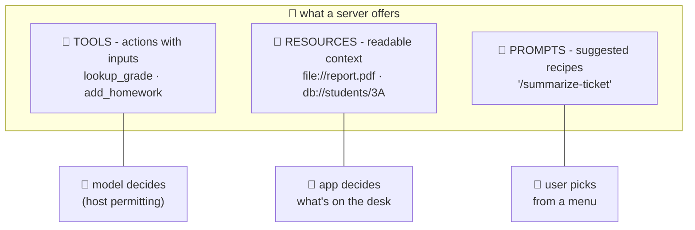

# 🧰 Lesson 03 — The three primitives: tools, resources, prompts

**📍 You are here:** Lesson **03** of 8 · Previous: `lesson-02-architecture` · Next: `lesson-04-the-wire`

---

## 📦 What's in this branch

Lessons 01–02, **plus** the three kinds of things a server can offer —
and who gets to decide when each is used.

## 🧒 Explain like I'm 5

An instrument announces its offerings on three labeled shelves:

1. **🧰 Tools — "things I can DO for the student."** Actions with
   inputs: `lookup_grade(student)`, `query_db(sql)`, `send_email(...)`.
   **The MODEL decides** when to call them (with the host's permission —
   L02!). This is the shelf 90% of today's servers lead with, and the
   only one our school server stocks.
2. **📁 Resources — "things you may READ from me."** Context with
   addresses: a file, a database record, a log. **The HOST/APP decides**
   what to attach to the desk (AI course L08) — like the teacher
   choosing which handouts go on the student's desk before class.
3. **📜 Prompts — "recipes I suggest."** Pre-written prompt templates
   the server ships: "summarize a ticket like THIS". **The USER picks**
   them (slash-commands, menu items) — like worksheets the instrument's
   manufacturer includes in the box.

One decision each: model→tools, app→resources, user→prompts. That's the
whole taxonomy — say it twice and you know more MCP than most people
shipping servers. 😄

## 🗺️ Diagram



## ❓ What

- **Tool** = name + description + **inputSchema** (JSON Schema). The
  description is FOR THE MODEL — it's how the student knows when to
  reach for the instrument. Write it like a good docstring; vague
  descriptions = tools that never get called (or worse, get called
  wrong).
- **Resource** = URI + content. Hosts can subscribe to changes. Think
  "attachable context", not "action".
- **Prompt** = named template with arguments, rendered into messages.
  Underrated for standardizing team workflows.
- Servers declare which shelves they stock in their **capabilities**, answered by `server/discover` (lesson 04) — our server says `{"tools": {}}` and
  nothing else, which is honest and fine.

**Who initiates, who consumes** — one table for the three shelves:

| Shelf | Who initiates | Who consumes | Wire verbs |
|---|---|---|---|
| 🧰 tools | the **model** proposes (host permitting) | the model — result → desk | `tools/list`, `tools/call` |
| 📁 resources | the **host/app** attaches | the model — context on the desk | `resources/list`, `resources/read` |
| 📜 prompts | the **user** picks (menu, slash-command) | the model / the app | `prompts/list`, `prompts/get` |

## 🤔 Why

Teams misdesign servers by shoving everything into tools ("read_file as
a tool!" — sometimes right, but if the APP should control context, it's
a resource). Knowing WHO decides per shelf — model/app/user — is the
design compass. It's also a security compass: tools act, so tools get
the guardrails (L05); resources read, so they get the privacy review.

## 🧪 Try it

```bash
python3 client/mini_client.py    # part 2 prints the tools shelf
```

Read the three tool descriptions aloud. Then, on paper, redesign our
school server properly stocked: which of these belong on which shelf?
*grade report card for 3A* (resource — the app attaches it), *"write a
parent email about grades" template* (prompt — the user picks it),
*add_homework* (tool — the model acts, host confirms). Now check
[school_server.py](../../server/school_server.py)'s TOOLS list — what
would you add as `resources/list` if you extended it? (Lesson 06 dares
you to.)

## ✅ Verify — what you should see

Part 2 of the scripted run lists exactly three tools with their descriptions; part 1 (`server/discover`) reported `stocks: tools` — no resources or prompts, matching the server's `capabilities`.

## 🏁 What you just proved

You can classify any capability by who decides — model → tool, app → resource, user → prompt — and read a server's shelves from its capabilities before calling anything.

## ⚠️ Common mistakes

- making everything a tool — if the app should control what goes on the desk, it is a resource
- writing tool descriptions for humans — the model reads them; vague descriptions mean tools that never get called
- forgetting that `capabilities` is a promise: declaring `tools` and not answering `tools/list` breaks every host

> 🏭 **Why this matters in production:** servers with sharp descriptions and rich `inputSchema` (enums, required fields) get called correctly; that is cheaper model-steering than any prompt engineering. Spend design time on the shelf, not the plumbing.

## ⏭️ Next

Time to read the actual bytes: the badge, discovery and calls —
**the wire**, as a sequence diagram you'll recognize forever.

```bash
git checkout lesson-04-the-wire
```
