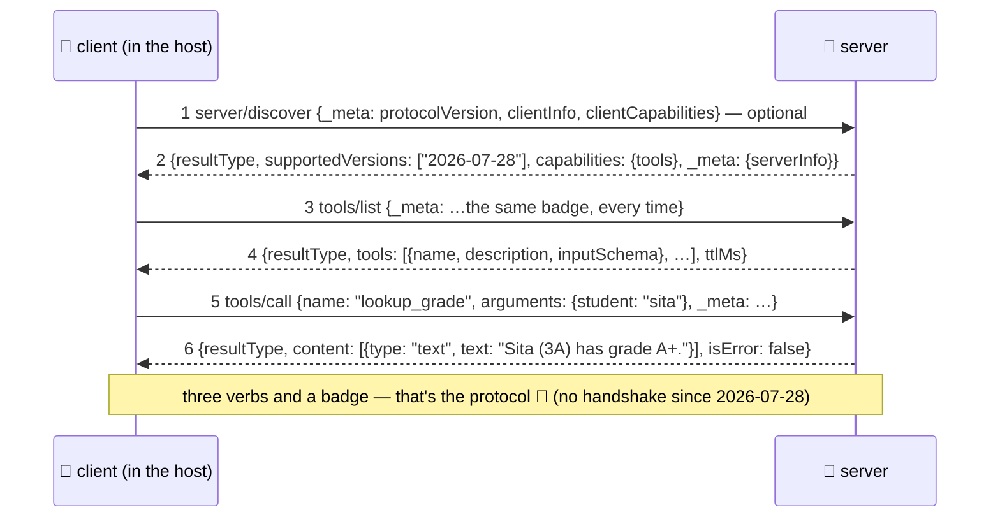

# 🪪 Lesson 04 — The wire: badge, discovery, calls (protocol revision 2026-07-28)

**📍 You are here:** Lesson **04** of 8 · Previous: `lesson-03-primitives` · Next: `lesson-05-transports-security`

---

## 📦 What's in this branch

Lessons 01–03, **plus** the actual conversation, message by message —
the sequence diagram that IS the protocol, as of revision **2026-07-28**
(the current one; the box at the end of ❓ What says what changed and why).

## 🧒 Explain like I'm 5

Plugging an instrument into a room *used* to start with a little ritual
("hello, I speak socket-standard 2025"). Not any more. Now **every
message wears an ID badge** 🪪, so no ritual is needed:

1. **🪪 The badge.** Every request carries `_meta`: *which revision I
   speak* (`io.modelcontextprotocol/protocolVersion`), *who I am*
   (`…/clientInfo`) and *what I can do* (`…/clientCapabilities`). The
   instrument checks the badge on every message and answers — or, if it
   doesn't speak that revision, says so (`UnsupportedProtocolVersion`,
   listing the revisions it does speak). Optional but polite:
   **introductions** (`server/discover`) — "who are you, what do you
   speak, which shelves do you stock?" Our client always asks; a client
   may skip it and just start talking.
2. **📋 "What do you offer?"** (`tools/list`) — the instrument reads out
   its shelf: names, descriptions, input forms.
3. **🧰 "Do the thing."** (`tools/call` with name + arguments) — the
   instrument does real work and hands back content for the desk.

That's… the whole language. **Three verbs and a badge.** Every message
is **JSON-RPC 2.0**: requests carry an `id` (answers must quote it back
— that's how the socket matches question to answer), notifications
don't (fire-and-forget — our server ignores them), errors come as
`error` with a code. Every result says `resultType: "complete"` and
carries the server's own badge (`_meta` → `serverInfo`).

## 🗺️ Diagram — the sequence you'll see everywhere



## ❓ What

- **JSON-RPC 2.0 shapes** (all of them appear in our demo output):
  - request: `{"jsonrpc":"2.0","id":N,"method":"…","params":{…, "_meta":{…}}}`
  - response: `{"jsonrpc":"2.0","id":N,"result":{"resultType":"complete", …}}` (same id!)
  - error: `{"jsonrpc":"2.0","id":N,"error":{"code":…,"message":…,"data":…}}`
  - notification: no `id` → no response ever.
- **Version negotiation is per request**: the badge names a revision
  (`2026-07-28` here); a server that doesn't speak it answers
  `-32022 Unsupported protocol version` with `data.supported: [...]`,
  and the client retries with one of those. No session, no memory of you
  between requests — which is exactly why any server instance behind a
  load balancer can answer any request.
- **Capabilities** = the shelf list (L03), answered by `server/discover`:
  our server says `{"tools": {}}`. Clients declare theirs in the badge —
  it's mutual.
- **Results** always carry `resultType` — `"complete"`, or
  `"input_required"` when a server needs something from the host first
  (the multi-round-trip pattern that replaced server-initiated
  sampling/elicitation requests) — and usually `_meta.serverInfo`. List
  results add `ttlMs`/`cacheScope` so hosts may cache the shelf.
- Tool results are **content arrays** (`{"type":"text",…}` — images and
  more exist) plus `isError` — tool failures are *data for the model to
  react to*, not protocol crashes. An unknown tool *name* IS a protocol
  error (`-32602`). Look at
  [school_server.py](../../server/school_server.py)'s `tools/call`
  handler: both kinds are there.
- More verbs exist for the other shelves (`resources/list`,
  `prompts/get`, …) and for change notifications (`subscriptions/listen`)
  — same grammar, learn on demand.

> ⏳ **What changed, and why you'll still meet the old way.** Until
> revision 2025-11-25 every session began with a handshake —
> `initialize` → `notifications/initialized` — and the server remembered
> you (a session; `Mcp-Session-Id` on HTTP). Revision **2026-07-28**
> retired that: requests are self-describing, sessions are gone, and
> `server/discover` is the optional way to ask up front. Older servers
> still expect the handshake; our client deliberately speaks only the
> modern revision, and our server answers a legacy `initialize` with
> `-32022` plus the list of revisions it does speak — the spec's
> recommended way to be honest with an old client.

## 🤔 Why

Once you can READ the wire, MCP debugging becomes lesson-16-of-k8s
style triage instead of vibes: `-32022` on the first request? (version
mismatch — the badge named a revision the server doesn't speak.) Tool
never called? (bad description — the model can't see your shelf
properly, L03.) Call hangs? (id mismatch or the server died — check
stderr.) Ninety percent of "MCP doesn't work" is visible in six messages
you now know by heart.

## 🧪 Try it — the diagram, live

```bash
python3 client/mini_client.py
```

Hold this lesson's sequence diagram next to the output: messages 1–6,
in order, real. Then the pop quiz: which field is on EVERY `→` line?
(The `_meta` badge.) Now break it on purpose — comment out the
`META + "protocolVersion"` line of `BADGE` in `mini_client.py`, rerun,
and read the server's refusal: `-32022`, with the revisions it does
speak. Put it back, run with `--drive`, call
`lookup_grade {"student":"nobody"}` — find the polite `isError` answer
in the wire; then `fly_to_moon {}` for the other kind of error.

## ✅ Verify — what you should see

The scripted run shows six messages in this exact order: `server/discover` → its result (`supportedVersions`, `capabilities`, `_meta.serverInfo`); `tools/list` → `{resultType, tools:[…]}`; `tools/call` → `{resultType, content:[…], isError:false}`. Every `→` line carries the `_meta` badge with `io.modelcontextprotocol/protocolVersion: "2026-07-28"`. Remove the `protocolVersion` line from `BADGE` and the first reply becomes `error -32022 Unsupported protocol version` listing `supported: ["2026-07-28"]`.

## 🏁 What you just proved

You can read the current MCP lifecycle by eye: three verbs, a badge on every request, `resultType` on every result, and a version error you can trigger and recover from.

## ⚠️ Common mistakes

- looking for `initialize` — there is none since 2026-07-28; a server that answers your first request with `-32022` is telling you which revisions it speaks
- reusing a JSON-RPC `id` — the answer is matched by id; a retry must get a new one
- treating `isError: true` as a protocol failure — it is a normal result carrying a tool's complaint, meant for the model

> 🏭 **Why this matters in production:** version negotiation now happens on every request, which is what lets any server instance behind a load balancer answer any request with no shared session store. Log the badge (`clientInfo`, version) on the server side — it is your best debugging breadcrumb.


## ⏭️ Next

How the messages travel (stdio vs Streamable HTTP) — and the security
lesson that must not be skipped: **transports & trust**.

```bash
git checkout lesson-05-transports-security
```
