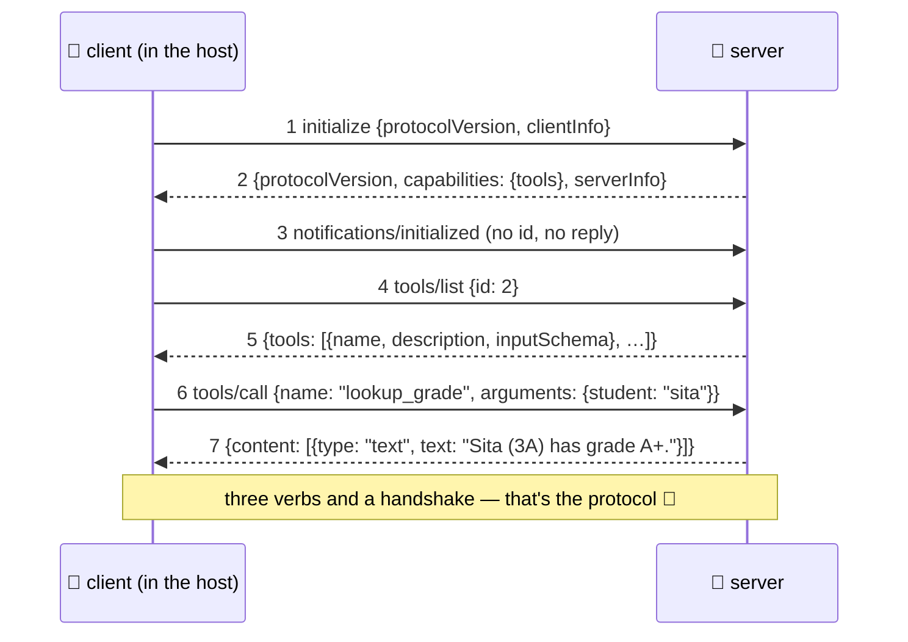

# 🤝 Lesson 04 — The wire: handshake, discovery, calls

**📍 You are here:** Lesson **04** of 8 · Previous: `lesson-03-primitives` · Next: `lesson-05-transports-security`

---

## 📦 What's in this branch

Lessons 01–03, **plus** the actual conversation, message by message —
the sequence diagram that IS the protocol.

## 🧒 Explain like I'm 5

Plugging an instrument into a room is a tiny ritual, always the same:

1. **🤝 "Hello, I speak socket-standard 2025."** The socket introduces
   itself (`initialize`: protocol version + who I am); the instrument
   answers with ITS version, name, and **which shelves it stocks**
   (capabilities). Then the socket says "great, I'm settled in"
   (`notifications/initialized` — a note, not a question: no reply).
2. **📋 "What do you offer?"** (`tools/list`) — the instrument reads
   out its shelf: names, descriptions, input forms.
3. **🧰 "Do the thing."** (`tools/call` with name + arguments) — the
   instrument does real work and hands back content for the desk.

That's… the whole language. Three verbs and a handshake. Every message
is **JSON-RPC 2.0**: requests carry an `id` (answers must quote it back
— that's how the socket matches question to answer), notifications
don't (fire-and-forget), errors come as `error` with a code.

## 🗺️ Diagram — the sequence you'll see everywhere



## ❓ What

- **JSON-RPC 2.0 shapes** (all three appear in our demo output):
  - request: `{"jsonrpc":"2.0","id":N,"method":"…","params":{…}}`
  - response: `{"jsonrpc":"2.0","id":N,"result":{…}}` (same id!)
  - notification: no `id` → no response ever.
- **Version negotiation** matters: both sides state a protocol version
  (`2025-06-18` here) and agree — how the standard evolves without
  breaking old plugs.
- **Capabilities** in the handshake = the shelf list (L03): our server
  says `{"tools": {}}`. Clients also declare theirs — it's mutual.
- Tool results are **content arrays** (`{"type":"text",…}` — images
  and more exist) plus optional `isError: true` — tool failures are
  *data for the model to react to*, not protocol crashes. (Look at
  [school_server.py](../../server/school_server.py)'s `tools/call`
  handler: it catches exceptions and answers politely.)
- More verbs exist for the other shelves (`resources/list`,
  `prompts/get`, …) and extras (progress, cancellation) — same
  grammar, learn on demand.

## 🤔 Why

Once you can READ the wire, MCP debugging becomes lesson-16-of-k8s
style triage instead of vibes: handshake failed? (version/capability
mismatch.) Tool never called? (bad description — the model can't see
your shelf properly, L03.) Call hangs? (id mismatch or the server died
— check stderr.) Ninety percent of "MCP doesn't work" is visible in
seven messages you now know by heart.

## 🧪 Try it — the diagram, live

```bash
python3 client/mini_client.py
```

Hold this lesson's sequence diagram next to the output: messages 1–7,
in order, real. Then the pop quiz: which printed line is the
*notification*? (The one with no `id` — and note the server's silence
after it.) Now cause an error on purpose — run with `--drive` and call
`lookup_grade {"student":"nobody"}` — and find the graceful
`isError`-style answer in the wire.

## ⏭️ Next

How the messages travel (stdio vs HTTP) — and the security lesson that
must not be skipped: **transports & trust**.

```bash
git checkout lesson-05-transports-security
```
