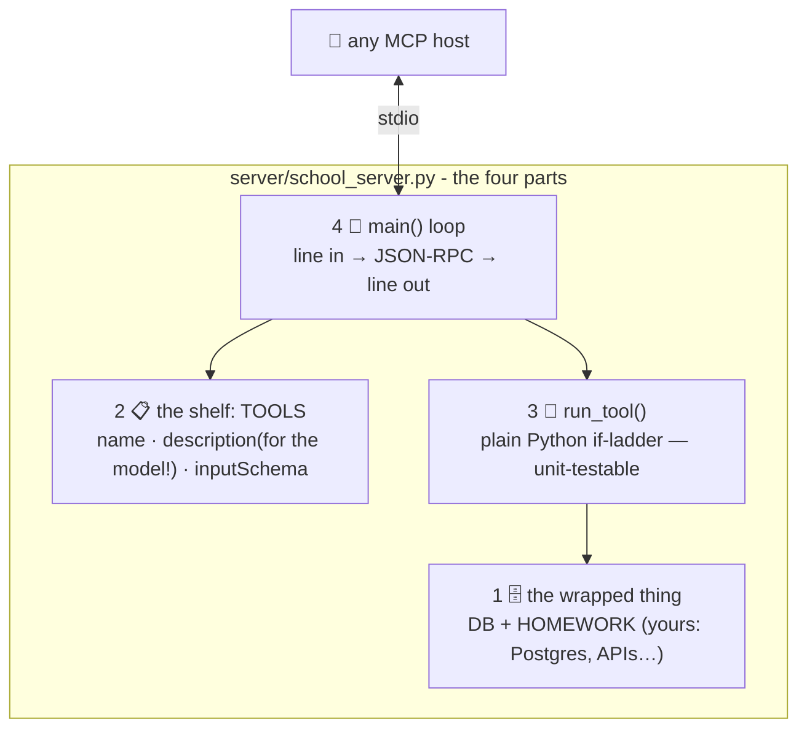

# 🔬 Lesson 06 — Build a server: ~125 honest lines

**📍 You are here:** Lesson **06** of 8 · Previous: `lesson-05-transports-security` · Next: `lesson-07-build-a-client`

---

## 📦 What's in this branch

Lessons 01–05, **plus** the guided read of a REAL MCP server —
[server/school_server.py](../../server/school_server.py) — and your
first extension to it.

## 🧒 Explain like I'm 5

Building an instrument sounds scary until you see one opened up. Ours
has exactly **four parts**, top to bottom of the file:

1. **The thing being wrapped** 🗄️ — a toy database (`DB`, `HOMEWORK`).
   In real servers this is the interesting part: your Postgres, your
   API, your filesystem. MCP is just the plug on the front.
2. **The shelf list** 📋 — `TOOLS`: three entries of name +
   description + inputSchema. Remember L03: **descriptions are for the
   model** — ours say what each tool does AND that `add_homework`
   writes (danger label, L05!).
3. **The dispatcher** 🔀 — `run_tool(name, args)`: a plain Python
   if-ladder doing the actual work. Nothing protocol-ish here — you
   could unit-test it alone.
4. **The plumbing** 🔧 — `main()`: read a line, parse JSON, **check the
   badge** (wrong revision → `-32022` with the revisions we do speak),
   answer the three methods you know from L04 (`server/discover`,
   `tools/list`, `tools/call`), print the reply. Tool failures → polite
   `isError` content, never a crash; unknown tool → a proper `-32602`.

That's a server. The official SDKs (Python/TypeScript `mcp` packages)
give you decorators, typed schemas, transports and the long tail of the
spec — use them for real work — but they're automating THESE four
parts, and now you've seen the parts.

## 🗺️ Diagram



## 📖 Read these lines (so you don't get lost)

[server/school_server.py](../../server/school_server.py):

- lines 20–25: part 1, the wrapped thing (`DB`, `HOMEWORK`)
- lines 27–55: part 2, the shelf (`TOOLS`)
- lines 57–71: part 3, the dispatcher (`run_tool`)
- lines 74–84: part 4a, the two reply helpers (badge + `resultType` on every result)
- lines 85–end: part 4b, the loop — badge check first, then the three verbs

## ❓ What (the details worth stealing)

- `flush=True` on every print — stdio servers that forget this "hang"
  mysteriously (the classic first bug: buffered replies never arrive).
- Answer **only what you're asked**; unknown method + id → error
  `-32601`. Notifications get silence, not errors.
- **Two error kinds, on purpose**: a *protocol* error (`error` with a
  code: wrong version `-32022`, unknown tool `-32602`) vs a *tool*
  error (`result` with `isError: true`) — the second is for the model.
- Every `reply()` adds `resultType: "complete"` and the server's badge
  (`_meta` → `serverInfo`); list results add `ttlMs`/`cacheScope` so
  hosts may cache the shelf.
- Tool errors as `{"content":[…], "isError": true}` — the model can
  read the failure and try again (an agent's retry loop, AI course
  L11, depends on this!).
- Schemas are contracts: `"enum": ["3A","3B"]` means the model gets
  told the legal values — fewer bad calls, better behavior. Rich
  schemas are cheap model-steering.
- Real-world upgrades from here: the official SDK, `resources/list`
  for report cards (L03's homework!), env-var secrets, and a scoped
  DB account (least privilege — AWS course L03).

## 🤔 Why

Because "we should build an MCP server for our X" is now a sprint
ticket in half the industry — and you can estimate it honestly: the
plug is a day (SDK makes it hours); the REAL work is part 1 (what to
expose) and part 2's descriptions + danger labels (design, L03/L05).
Teams that get those right ship servers agents actually use correctly.

## 🧪 Try it — extend it for real

```bash
# 1) prove the baseline:
python3 client/mini_client.py

# 2) YOUR first tool — add to TOOLS in server/school_server.py:
#    {"name":"list_homework","description":"Show the homework list (read-only).",
#     "inputSchema":{"type":"object","properties":{}}}
#    …and to run_tool():
#    if name == "list_homework":
#        return f"Homework: {json.dumps(HOMEWORK) or '[]'}"

# 3) rerun the client — your tool appears in discovery, callable:
python3 client/mini_client.py --drive
# model calls> list_homework {}
```

Your first MCP server change: shipped. 🔬

## ✅ Verify — what you should see

After adding `list_homework`, discovery lists four tools and `--drive` → `list_homework {}` prints the homework list. `fly_to_moon {}` gives `❌ server error -32602: Unknown tool` (a protocol error), while `lookup_grade {"student":"nobody"}` gives a result flagged `isError` (the tool talking).

## 🏁 What you just proved

You changed a real MCP server's shelf and dispatcher without touching its plumbing — and you saw both error kinds the spec defines.

## ⚠️ Common mistakes

- forgetting `flush=True` — the classic "the server hangs" bug: replies sit in a buffer
- printing debug output to stdout — stdout IS the wire; log to stderr
- answering notifications (messages without `id`) — they get silence, never a reply
- raising exceptions out of a tool — return `isError: true` content so the model can react

> 🏭 **Why this matters in production:** the official SDKs (`mcp` for Python/TypeScript) automate these four parts and add transports, schemas and auth — use them for real servers. The design work they cannot do for you is parts 1 and 2: what to expose, and descriptions with honest danger labels.

## ⏭️ Next

The other side of the socket: reading
**mini_client.py** — and why hosts, not models, hold the power.

```bash
git checkout lesson-07-build-a-client
```
