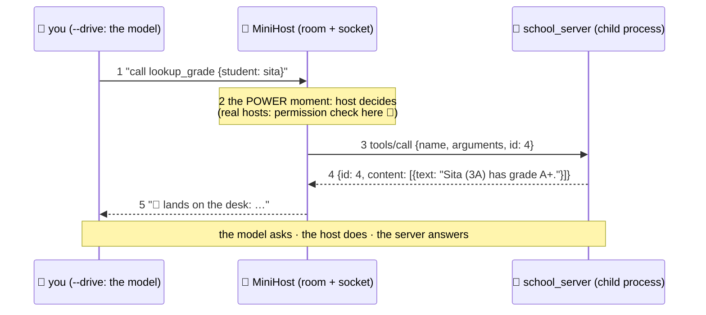

# 🔌 Lesson 07 — Build a client/host: the side with the power

**📍 You are here:** Lesson **07** of 8 · Previous: `lesson-06-build-a-server` · Next: `lesson-08-use-cases`

---

## 📦 What's in this branch

Lessons 01–06, **plus** the guided read of
[client/mini_client.py](../../client/mini_client.py) — the room, the
socket, and (in `--drive` mode) you as the student.

## 🧒 Explain like I'm 5

The client side has three jobs, and our 100-line host does all three:

1. **Launch & plug in** 🔌 — `subprocess.Popen([...python, server])`:
   the stdio transport IS just "start the child, hold its stdin/
   stdout" (L05, live). One `MiniHost` = one socket = one server (L02).
2. **Speak the ritual** 🤝 — `send()` builds JSON-RPC: stamps
   incrementing `id`s on requests, skips ids for notifications, writes
   a line, reads a line, **matches the answer by id**. Then `main()`
   performs L04's exact sequence: initialize → initialized →
   tools/list → tools/call.
3. **Sit between model and world** 🧠→🔌 — in scripted mode, three
   canned calls play "what an agent would do". In `--drive` mode, YOU
   type the calls — and here's the lesson hiding in the fun: **the
   model only ever produces text asking for a call.** The host chooses
   to execute. Which means the host is where permission prompts,
   allow-lists, write-gates (L05 rule 3!) and logs belong. Hosts hold
   the power; that's by design.

A real host adds exactly what you'd guess: a real model proposing the
calls (AI course L11's loop), tool results appended to the model's
context (the desk, AI course L08), multiple sockets at once, and the
consent UI. Plumbing-wise? You've now read all of it.

## 🗺️ Diagram



## ❓ What (details worth stealing)

- **id bookkeeping** is the whole client trick: `self.next_id += 1` on
  send, match on receive. Async hosts keep a pending-map; ours reads
  synchronously so the very next line IS the answer.
- Notifications (`is_notification=True`) write-and-move-on — waiting
  for a reply to a notification is the second-classic client bug
  (deadlock; the server owes you nothing).
- Real hosts also: handle `isError` results by SHOWING them to the
  model (retries!), reconnect dead children, and merge tool lists from
  many servers into one shelf for the model.
- Where's the LLM API call? Deliberately absent — swap the `input()`
  in `--drive` for a model call and you have a real agent host. (The
  AI course's L11 lab did this with paste; here it's one function.)

## 🤔 Why

Every MCP question of the form "can the model just…?" is answered by
this file: **no — it can only ask.** Understanding the host's
chokepoint tells you where safety lives, why host quality matters more
than server count, and exactly what you're trusting when you toggle
"always allow" in some app's MCP settings (you're deleting line 2 of
the sequence diagram above 😄).

## 🧪 Try it

```bash
python3 client/mini_client.py --drive
# model calls> get_student_count {"class_name":"3B"}
# model calls> add_homework {"title":"build my own host"}
```

Then the one-line power-up from L05: add a write-gate before the
`tools/call` in `--drive` mode (`if name.startswith("add"): input("allow? ")`).
Run again, feel the difference. You've now built both sides of MCP and
its most important safety feature. 🔌

## ⏭️ Next

The finale: five real-world setups — coding, support, data, meetings,
automation — each with a numbered flow AND a sequence diagram.

```bash
git checkout lesson-08-use-cases
```
