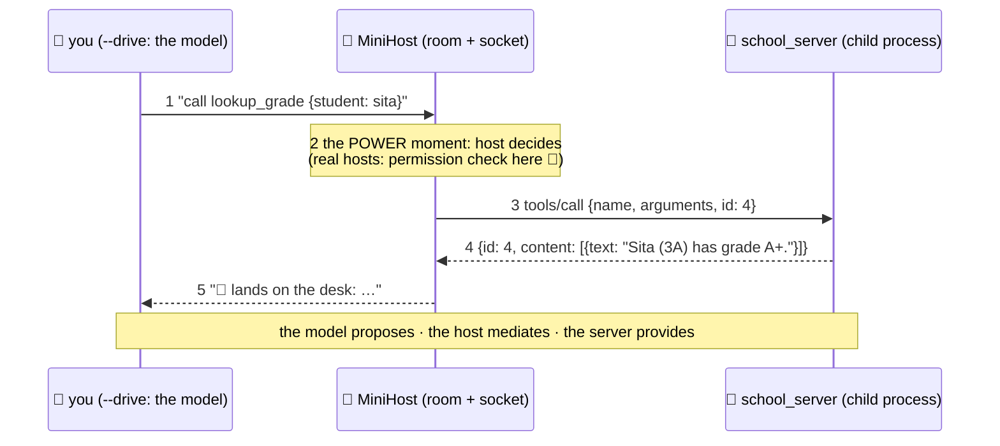

# 🔌 Lesson 07 — Build a client/host: the side with the power

**📍 You are here:** Lesson **07** of 8 · Previous: `lesson-06-build-a-server` · Next: `lesson-08-use-cases`

---

## 📦 What's in this branch

Lessons 01–06, **plus** the guided read of
[client/mini_client.py](../../client/mini_client.py) — the room, the
socket, and (in `--drive` mode) you as the student.

## 🧒 Explain like I'm 5

The client side has three jobs, and our ~105-line host does all three:

1. **Launch & plug in** 🔌 — `subprocess.Popen([...python, server])`:
   the stdio transport IS just "start the child, hold its stdin/
   stdout" (L05, live). One `MiniHost` = one socket = one server (L02).
2. **Wear the badge** 🪪 — `send()` builds JSON-RPC: stamps an
   incrementing `id`, adds the `_meta` badge (revision, `clientInfo`,
   `clientCapabilities`) to every request, writes a line, reads a line,
   **matches the answer by id**. Then `main()` performs L04's exact
   sequence: server/discover (optional) → tools/list → tools/call.
3. **Sit between model and world** 🧠→🔌 — in scripted mode, three
   canned calls play "what an agent would do". In `--drive` mode, YOU
   type the calls — and here's the lesson hiding in the fun: **the model proposes a call, in text; the host mediates.** The host
   chooses whether to execute — and it is also the side that answers a
   server's own questions (results marked `input_required`, revision
   2026-07-28's replacement for server-initiated sampling/elicitation
   requests). Which means the host is where permission prompts,
   allow-lists, write-gates (L05 policy 3!) and logs belong. Hosts hold
   the power; that's by design.

A real host adds exactly what you'd guess: a real model proposing the
calls (AI course L11's loop), tool results appended to the model's
context (the desk, AI course L08), multiple sockets at once, and the
consent UI. Plumbing-wise? You've now read all of it.

## 🗺️ Diagram



## 📖 Read these lines (so you don't get lost)

[client/mini_client.py](../../client/mini_client.py):

- lines 19–23: the badge every request wears (`BADGE`)
- lines 25–34: launching the child process — the stdio transport
- lines 35–50: `send()` — one request, one reply, matched by id
- lines 52–60: `show()` — result on the desk, or the error explained
- lines 62–76: `main()` — introductions, discovery
- lines 77–end: `--drive` — the power moment; the gate goes right before `tools/call`

## ❓ What (details worth stealing)

- **id bookkeeping** is the whole client trick: `self.next_id += 1` on
  send, match on receive. Async hosts keep a pending-map; ours reads
  synchronously so the very next line IS the answer.
- **Errors vs results**: `send()` hands back the whole response. A
  JSON-RPC `error` (unknown tool `-32602`, wrong revision `-32022`) is a
  protocol problem the host handles; `isError: true` *inside* a result is
  the tool talking — show that one to the model. `show()` does both.
- Real hosts also: handle `isError` results by SHOWING them to the
  model (retries!), reconnect dead children, and merge tool lists from
  many servers into one shelf for the model.
- Where's the LLM API call? Deliberately absent — swap the `input()`
  in `--drive` for a model call and you have a real agent host. (The
  AI course's L11 lab did this with paste; here it's one function.)

## 🤔 Why

Every MCP question of the form "can the model just…?" is answered by
this file: **no — it can only propose; the host mediates.** Understanding the host's
chokepoint tells you where safety lives, why host quality matters more
than server count, and exactly what you're trusting when you toggle
"always allow" in some app's MCP settings (you're deleting line 2 of
the sequence diagram above 😄).

## 🧪 Try it

```bash
python3 client/mini_client.py --drive
# model calls> get_student_count {"class_name":"3B"}
# model calls> add_homework {"title":"build my own host"}
```

Then the one-line power-up from L05: add a write-gate before the
`tools/call` in `--drive` mode (`if name.startswith("add"): input("allow? ")`).
Run again, feel the difference. The `--drive` prompt suggests four
sequences (a–d): (a) two reads, (b) a tool error the model can act on,
(c) the missing gate, (d) a protocol error the host survives — run them
all. You've now built both sides of MCP and its most important safety
feature. 🔌

## ✅ Verify — what you should see

With the six-line gate added before `tools/call` in `--drive`, `add_homework` waits for `allow?` and `n` prints nothing on the desk, while `lookup_grade` still runs without asking. `fly_to_moon {}` prints `❌ server error -32602` and the loop continues — the host survived a protocol error.

## 🏁 What you just proved

The host is the power boundary: you inserted a human decision between the model's proposal and the wire, in the only place that can see both.

## ⚠️ Common mistakes

- waiting for a reply after sending a notification — the server owes nothing for messages without an id (deadlock)
- swallowing `isError` results instead of showing them to the model — retries depend on seeing the failure
- letting a JSON-RPC error kill the host — handle `error` responses, keep the loop alive
- "always allow" in a real host's settings deletes step 2 of the sequence diagram — know that is what you are toggling

> 🏭 **Why this matters in production:** hosts merge tool lists from many servers into one shelf, reconnect dead child processes, and put consent UI, allow-lists and audit logs around every call. Host quality matters more than server count.

## ⏭️ Next

The finale: five real-world setups — coding, support, data, meetings,
automation — each with a numbered flow AND a sequence diagram.

```bash
git checkout lesson-08-use-cases
```
