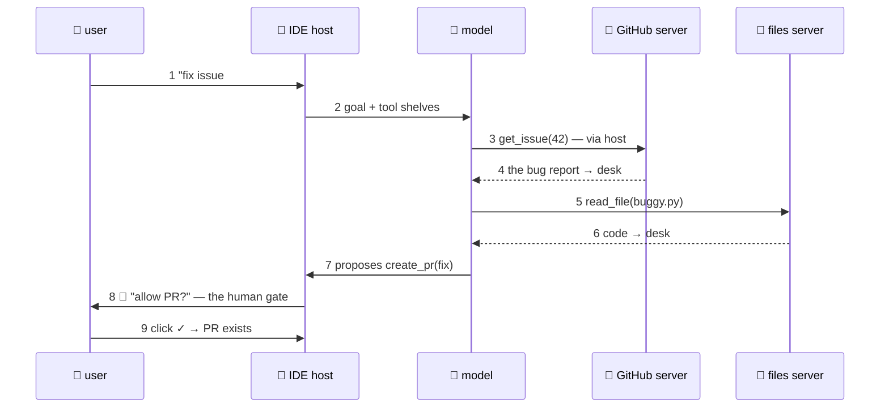

# 🌍 Lesson 08 — Five real-world use cases (with sequence diagrams)

**📍 You are here:** Lesson **08** of 8 — the final lesson!

---

## 📦 What's in this branch

The complete course, **plus** the payoff: five production-shaped
setups. Each is drawn twice on the site — a numbered flow diagram AND a
step-by-step sequence diagram:
**🌐 [the illustrated use-cases page](https://baluraut.github.io/learn-mcp-school/use-cases.html)** ← open it beside this lesson.

## 🧒 The five, in school words

**1. 🐙 The coding assistant** (IDE + GitHub server + filesystem server)
*"Fix issue #42."* The student reads the complaint (get_issue), reads
the code (read_file), writes a fix, runs the tests (run_tests), drafts
the PR — **create_pr waits for your click** (L05 policy 3).
Why MCP: the same GitHub server works in every IDE and agent — write
once, plug everywhere.

**2. 🎧 The support desk** (support app + orders-DB server + docs server)
Customer: "where's my refund?" → look up the order (read-only!), fetch
the refund policy → grounded answer with receipts — RAG's open-book
exam (AI course L10) wearing MCP plugs. The DB tool is SELECT-only via
a scoped account (AWS course L03's least privilege, verbatim).

**3. 📊 The data analyst** (chat app + SQL server + chart server)
"Which product sold best last month, per region?" → query_db →
make_chart → numbers with a picture. The schema's `enum`/read-only
design (L06) is what keeps "analyst" from becoming "DROP TABLE". 😅

**4. 📅 The meeting-prep butler** (assistant + calendar + CRM + email)
"Prep me for the 3 pm" → get_event → crm_lookup(company) →
recent_threads(attendees) → one tidy brief. THREE servers, one room,
one desk — the N+M payoff in a single request.

**5. 📁 The report robot** (agent + filesystem + Slack server)
"Summarize this folder's weekly reports and post to #team" → list_dir →
read_file ×N → summarize → **slack_post waits for your click** — the
write-gate again, because automation without gates is L05's incident
report.

## 🗺️ Diagram (use case 1, the shape of them all)



## ❓ What the five have in common (the checklist you'll reuse)

- **Reads flow, writes gate** — every case marks which tools change
  the world, and those get the click (L05).
- **Least-privilege plumbing** — scoped DB accounts, repo-only tokens
  (the AWS course's IAM instincts, now for AI).
- **Same servers, many rooms** — each server in these stories is
  reusable across apps; that's WHY teams bother (L01's N+M).
- **The desk explains the limits** — huge folders / giant queries hit
  context limits (AI course L08); production versions add pagination
  and summaries server-side.
- **It's all six messages** — every sequence above is L04's
  badge-discover-call, repeated. Read one wire, read them all.

**The three policies, again** (L05 — memorise the numbers): **1** a local
server runs with that process's permissions (a remote one has its own
identity); **2** tool results are data, never commands; **3** writes get
a human gate. Where the gate sits in each case:

| Case | Reads (flow) | Writes (gate) |
|---|---|---|
| 🐙 coding assistant | get_issue, read_file, run_tests | `create_pr` → the click in the IDE |
| 🎧 support desk | order lookup (SELECT-only account), policy docs | none today — a `refund_issue` tool would need one |
| 📊 data analyst | query_db (SELECT-only), make_chart | none — any write tool, or a non-scoped account, would need the click |
| 📅 meeting-prep butler | get_event, crm_lookup, recent_threads | none — the moment "send the follow-up" is added, the email server's send tool gets the click |
| 📁 report robot | list_dir, read_file ×N | `slack_post` → "post to #team?" shown in full |

> ⛔ **The anti-pattern:** a write-capable database tool (INSERT/UPDATE/DELETE — or a DB account that *can*) handed to the model with no host-side confirmation. One injected sentence in a fetched ticket (policy 2) becomes a dropped table (policy 3 skipped). Scope the account, label the tool, gate the write.

## 🧪 Try it — your sixth use case

Pick a REAL workflow from your week (expense report? standup notes?
ticket triage?). On paper: which servers (existing or to-build)? which
tools per server — and which are writes (gates!)? Draw the sequence
diagram in the style above, numbered. If you can draw it, you can
build it — L06 and L07 were the whole toolkit.

## ✅ Verify — what you should see

For your sixth use case you can list, per server, which tools read and which write — and every write has a named gate (a click, a policy, a scoped account). If a write has no gate, the design is not done.

## 🏁 What you just proved

You can read any MCP deployment as lesson 04's six messages plus lesson 05's three policies — and design one on paper before writing code.

## ⚠️ Common mistakes

- a write-capable DB tool (or a DB account that can write) with no host-side confirmation — the canonical anti-pattern
- gating reads too — friction makes people toggle "always allow", which removes the gate you actually needed
- one giant server for everything — servers are the unit of reuse and of permission; keep them narrow

> 🏭 **Why this matters in production:** the five cases share one shape: reads flow, writes gate, least-privilege plumbing, same servers in many rooms. Copy the shape, not the tools.

## 🎓 The socket is yours

The drawer problem → the three roles → the three shelves → six wire messages → the three trust policies → a real server → a real host → five
real deployments. **You didn't just learn MCP — you own a working
implementation of it.** 🔌🎓

```bash
git checkout main
python3 client/mini_client.py --drive    # one last spin, for fun
```
